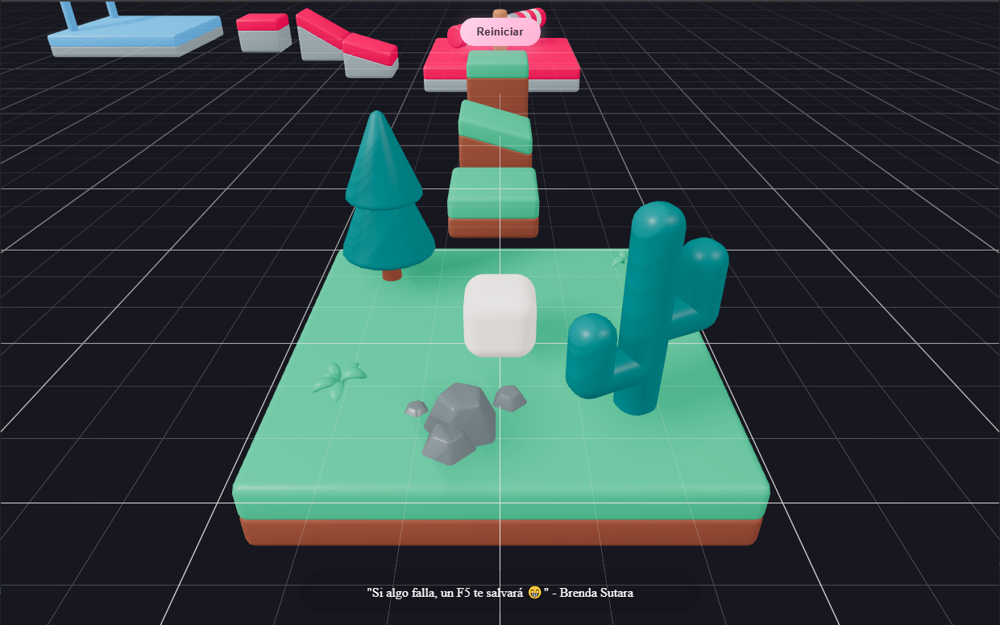
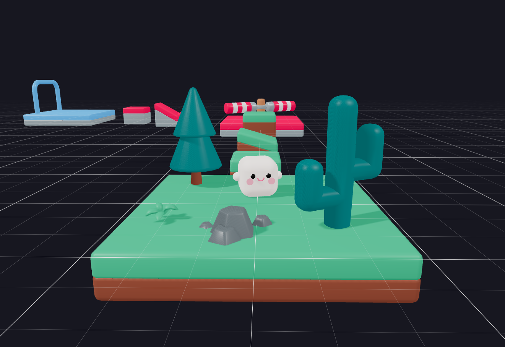
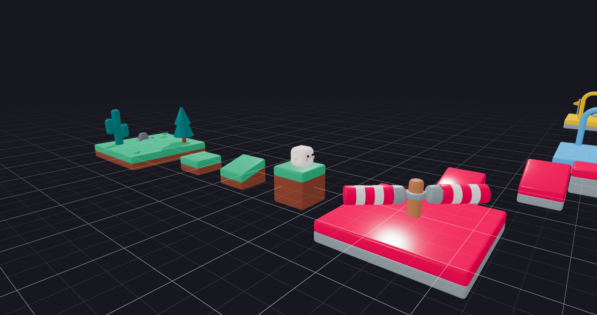
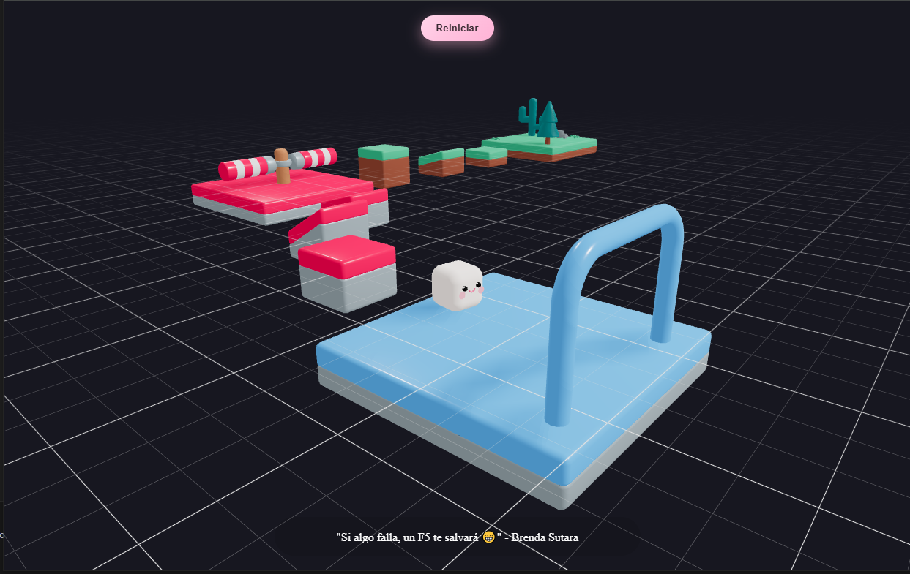
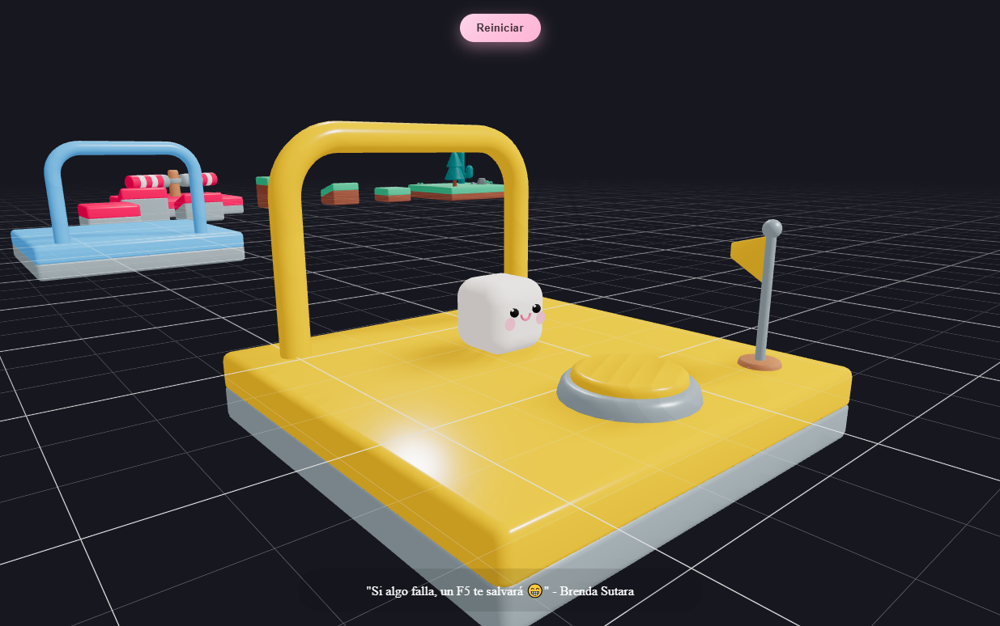
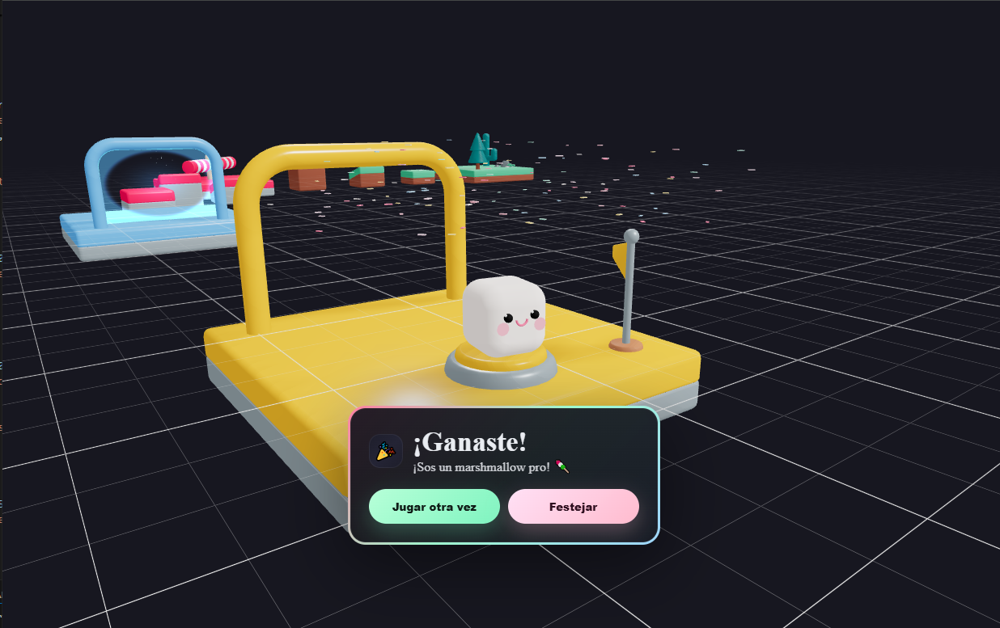

# 🧁 R3F Playground – Marshmallow Player

Proyecto de práctica donde exploro **física 3D** con **React Three Fiber** y **@react-three/rapier**. Es parte de un curso de introducción y agregué un tierno un personaje “marshmallow” kawaii.

## 👀 Capturas

  

  

  

  

  

  

## ✨ Features

- 🎮 **Third-person controller**: cámara que sigue al jugador.
- 🔄 **Rotación tank-style** (←/→ rotan, ↑/↓ avanzan/retroceden).
- 🧠 **Movimiento en el eje correcto**: velocidad local convertida a mundo con `applyEuler`.
- 🧗 **Salto sólido**: raycast corto hacia abajo (grounded), “un impulso por pulsación”.
- 🥊 **Golpe (punched)** por el _swiper_: frena el movimiento durante un instante.
- 🧱 **Colliders**:
  - Terreno y props con `colliders="trimesh"`.
  - Jugador con **CapsuleCollider** (no se engancha en bordes).
- 🧪 **Respawn**: sensor gigante bajo el mapa para reiniciar posición.
- 🫶 **Marshmallow kawaii**: cuerpo `RoundedBox` + ojos/brillos/boquita/mejillas.

---

## 📚 Curso & Créditos

**Curso:** _Welcome to React Three Fiber: The Ultimate Guide to 3D Web Development_ — módulo inicial para crear experiencias 3D en la web con R3F.

**Instructor:** **Wawa Sensei** — desarrollador francés radicado en Tokio 🗼. Comparte Three.js y React Three Fiber en su canal de YouTube con guías paso a paso y un enfoque claro para explicar conceptos complejos.

**Assets / Arte:** Mapa basado en el **KayKit – Mini-Game Variety Pack** de **Kay Lousberg** (royalty-free). Ideal para prototipos y ejercicios de gameplay.

**Tecnologías principales:**

- `react`, `react-dom`, `vite`
- `three` + `@react-three/fiber` + `@react-three/drei`
- `@react-three/rapier` (bindings de **Rapier** para física)

**Atribuciones y licencias:**

- El código de este repo se distribuye bajo **MIT**.
- Los **assets** (modelos/texturas) mantienen la licencia de sus autores; verificá los términos del KayKit antes de redistribuirlos.
- Marcas y nombres de terceros son propiedad de sus respectivos dueños.

> Proyecto con fines **educativos**: muchas decisiones (colliders, raycast, impulses, kinematic bodies, etc.) priorizan el aprendizaje por sobre la optimización para producción.
